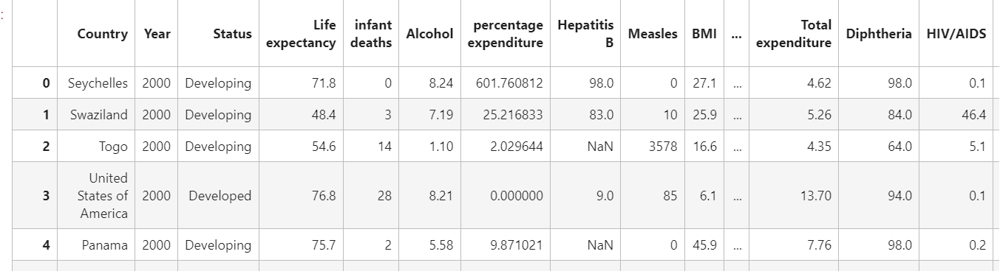
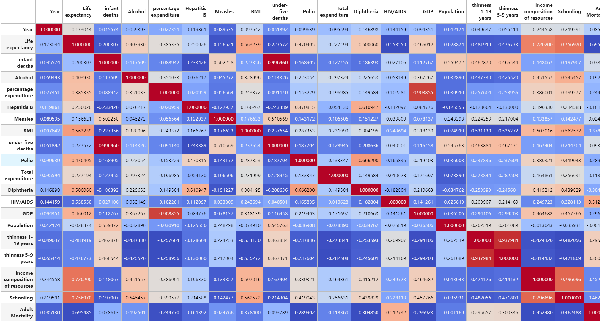

# 程序报告：成年人死亡率预测
学号：22451122 
姓名：王中昊
专业：软件工程

## 数据分析

首先观察数据组成，country数据没有没有明显的意义，可以舍弃。status代表是否为发展中国家，可以用pd.factorize将其二值化，也可以直接舍弃，这里我们选择直接舍弃。
```python
# Drop non-numeric columns
data = data.drop(["Country", "Status"], axis=1)
```



随后，可以计算各个特征与成人死亡率之间的皮尔逊相关系数
```python
corr = train_data[column_name].corr()
corr.style.background_gradient(cmap='coolwarm')
```


从图中发现，life expectancy和HIV/AIDS两个特征与成年人死亡率最为相关，这也是一个符合直觉的结论。

## 数据清洗
对数据项中的空值（也就是np.nan），使用对应列的均值来进行填充。随后，使用RobustScaler对特征标准化，这个缩放器对异常值具有鲁棒性，缩放器移除中位数，并根据四分位数范围（默认为IQR：四分位距）对数据进行缩放。IQR 是第一四分位数和第三四分位数之间的范围。以下是数据清洗函数preprocess_data的代码。
```python
def preprocess_data(data, imputer=None, scaler=None):
    # Drop non-numeric columns
    data = data.drop(["Country", "Status"], axis=1)
    # Impute missing values if imputer is not provided
    if imputer is None:
        imputer = SimpleImputer(strategy='mean', missing_values=np.nan)
        imputer = imputer.fit(data[COLUMN_NAMES[:-1]])
    data[COLUMN_NAMES[:-1]] = imputer.transform(data[COLUMN_NAMES[:-1]])
    # Scale data if scaler is not provided
    if scaler is None:
        scaler = RobustScaler()
        scaler = scaler.fit(data)
    data_norm = pd.DataFrame(scaler.transform(data), columns=data.columns)
    data_norm = data_norm.drop(['Year'], axis=1)
    return data_norm, imputer, scaler
```

我使用IsolationForest来判定离群值，在训练过程中直接丢弃离群的数据点。
```python
def detect_and_remove_outliers(data, label):
    # Initialize the IsolationForest outlier detector
    outlier_detector = IsolationForest(contamination=0.1, random_state=42)
    # Fit the detector to the data
    outlier_detector.fit(data)
    # Predict outliers in the data
    outliers = outlier_detector.predict(data)
    # Get indices of non-outliers
    removed_indices = np.where(outliers == 1)[0]
    # Keep only non-outliers in the data and label
    data = data[outliers == 1]
    label = label[outliers == 1]
    return data, label, removed_indices
```

## 模型训练

以下是主训练函数代码，我选取了5个模型，分别为随机森林、AdaBoost、决策树、岭回归、支持向量回归。在训练过程中，使用10折交叉验证，一共进行$5 \times 10 = 50$次实验。最终保存下来的best_model为所有实验中泛化能力最强的模型。
```python
def main():
    # Load training data
    train_data = pd.read_csv(TRAIN_DATA_PATH)

    # Initialize KFold cross-validation
    kf = KFold(n_splits=10, shuffle=True, random_state=42)

    best_model = None
    best_r2 = -np.inf
    best_imputer = None
    best_scaler = None
    best_model_name = None

    # List of models to evaluate
    model_list = ["RandomForestRegressor", "AdaBoostRegressor", "DecisionTreeRegressor", "Ridge", "SVR"]

    # Iterate over each model
    for model_name in model_list:
        for train_index, test_index in kf.split(train_data):
            # Split data into training and testing folds
            train_fold = train_data.iloc[train_index]
            test_fold = train_data.iloc[test_index]

            # Separate target variable
            train_y = train_fold['Adult Mortality'].values
            train_fold = train_fold.drop(["Adult Mortality"], axis=1)

            # Preprocess training data
            train_fold_norm, imputer, scaler = preprocess_data(train_fold, imputer=None, scaler=None)
            # train_fold_norm, train_y, rm_idx = detect_and_remove_outliers(train_fold_norm, train_y)
            train_x = train_fold_norm.values

            # Fit the model
            model = model_fit(model_name, train_x, train_y)

            # Separate target variable for testing data
            test_y = test_fold['Adult Mortality'].values
            test_fold = test_fold.drop(["Adult Mortality"], axis=1)
            test_fold_norm, _, _ = preprocess_data(test_fold, imputer=imputer, scaler=scaler)
            # test_fold_norm, test_y, rm_idx = detect_and_remove_outliers(test_fold_norm, test_y)
            # Make predictions
            y_pred = predict(model, test_fold, imputer, scaler)
            # y_pred = y_pred[rm_idx]

            # Calculate R2 score for testing data
            r2 = r2_score(test_y, y_pred)

            # Calculate R2 score for training data
            train_pred = model.predict(train_x)
            train_r2 = r2_score(train_y, train_pred)
            print(f"Model name: {model_name}, Fold Train R2: {train_r2}, Test R2: {r2}")

            # Update the best model if current model is better
            if r2 > best_r2:
                best_r2 = r2
                best_model = model
                best_model_name = model_name
                best_imputer = imputer
                best_scaler = scaler
                print(f"Best model updated: {model_name}, R2: {best_r2}")

    # Save the best model, imputer, and scaler
    joblib.dump(best_model, MODEL_FILENAME)
    joblib.dump(best_imputer, IMPUTER_FILENAME)
    joblib.dump(best_scaler, SCALER_FILENAME)
    print(f'Best model: {best_model_name}, R2: {best_r2}')

if __name__ == "__main__":
    main()
```

在每次拟合过程中，我提前定义超参数搜索区域，使用网格搜索来优化超参数。对于没有定义搜索区域的模型，直接使用默认超参数。
```python
def model_fit(model_name, train_x, train_y):
    # Define parameter grids for each model
    param_grids = {
        'MLPRegressor': {
            'hidden_layer_sizes': [(100, 100)],
            'activation': ['relu'],
            'max_iter': [1000],
            'solver': ['adam'],
        },
        'RandomForestRegressor': {
            'n_estimators': [100],
            'max_depth': [5, 10],
            'min_samples_split': [2, 5],
            'min_samples_leaf': [1, 2]
        },
        'AdaBoostRegressor': {
            'n_estimators': [50, 100],
            'learning_rate': [0.01, 0.1, 1]
        }
    }

    # Initialize the regressor based on the model name
    if model_name in param_grids:
        regressor = eval(model_name)()
        param_grid = param_grids[model_name]
        gs = GridSearchCV(regressor, param_grid, cv=5, scoring='r2', n_jobs=1)
        gs.fit(train_x, train_y)
        regressor = gs.best_estimator_
    else:
        regressor = eval(model_name)()
        regressor.fit(train_x, train_y)

    # Fit the model
    return regressor
```

模型预测函数用于给出测试集预测结果，使用与训练集一样的超参数处理方法。
```python
def predict(model, test_data, imputer, scaler):
    # Preprocess the test data
    test_data_norm, _, _ = preprocess_data(test_data, imputer=imputer, scaler=scaler)
    test_x = test_data_norm.values

    # Make predictions
    predictions = model.predict(test_x)
    return predictions
```

## 测试结果
以下是程序的运行样例，在运行过程中，最佳模型会依据测试精确度不断更新。最终得到的最佳模型RandomForest在测试数据中的R2可以达到0.69。


该模型在molab系统中的测试集R2为0.59

