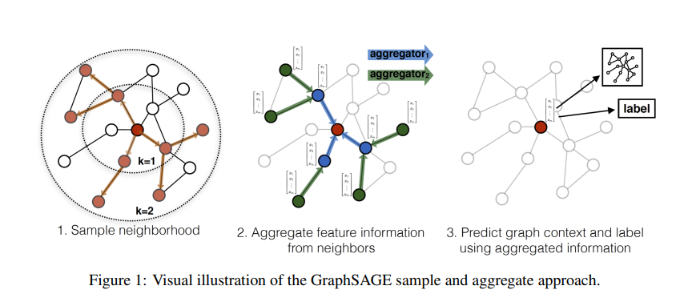
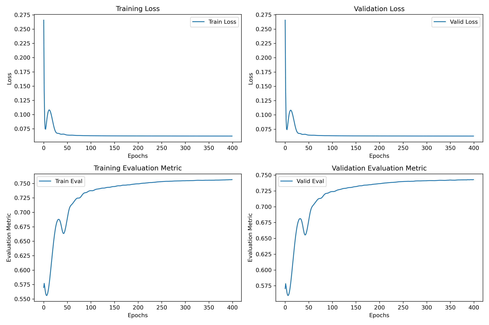

# 程序报告：金融异常检测
学号：22451122  
姓名：王中昊  
专业：软件工程

## 1. 任务描述

DGraph，是大规模动态图数据集的集合，由真实金融场景中随着时间演变事件和标签构成。本次实验用到的数据集是DGraph-Fin，它是一个有向无权重的动态图，表示Finvolution Group用户之间的社交网络。在该图中，一个节点代表一个Finvolution用户，从一个用户到另一个用户的边表示该用户将另一个用户视为紧急联系人。

DGraph-Fin的节点分为前台节点和后台节点。前台节点被标记为正常（0类）和欺诈（1类）的节点，这些节点被用于金融异常检测任务。后台节点与任务无关，主要用于维护图的连通性。所以这里的金融异常检测实际上是一个节点二分类任务，采用roc-auc来评价模型的分类效果。  


DGraph-Fin数据集的基本信息如下：

| Name        | Time Unit | Time span | # Node   | # Edge   | Is Directed | Node class | Edge class | Avg. Deg. | Avg. Out Deg. |
|-------------|-----------|-----------|----------|----------|-------------|------------|------------|-----------|---------------|
| DGraph-Fin  | Day       | ~ 2 Years | 3,700,550| 4,300,999| ✔           | 4          | 4          | 2.16      | 1.62          |

这是一个大规模稀疏网络。


## 2. 算法介绍

本次实验我实现了5种算法，分别为MLP，GCN，GIN，GAT，GraphSAGE，代码将提供在附录中。经过大量实验，GraphSAGE能取得最好的测试集精确度。

GraphSAGE是斯坦福大学的snap团队在NIPS 2017上提出的工作。这项工作的特点是提出了第一个归纳式（inductive）的图神经网络模型。
先前的图神经网络工作，如Tomas Kipf提出的GCN，采用直推式（transductive）的方式提取节点的特征信息：
$$
{\bf X}^{\prime}={\bf\hat{D}}^{-1/2}{\hat{\bf A}}{\hat{\bf D}}^{-1/2}{\bf X}\Theta
$$
以上的${\bf\hat{D}}^{-1/2}{\hat{\bf A}}{\hat{\bf D}}^{-1/2}$为正定归一化的拉普拉斯矩阵，等价于使用拉普拉斯低通滤波器对图信号进行滤波。
使用这种方法的前提是在训练过程中使用到的网络拓扑结构与预测任务中的网络拓扑结构一致。这是因为一旦要将训练好的GCN模型应用于未知的网络拓扑结构，则图的拉普拉斯矩阵随即改变，GCN模型将会失效。

如果存在训练过程的网络拓扑结构与预测任务中拓扑结构不一致的情况，则有必要开发一个新的归纳式（inductive）的图神经网络模型。
GraphSAGE解决了这个问题，在每次message passing过程中，GraphSAGE采用以下方式更新节点嵌入：

$$
{\bf x}_{i}^{\prime}={\bf W}_{1}{\bf x}_{i} + \mathbf{W}_{2}\cdot\mathbf{m}\mathrm{e}\mathrm{an}_{j\in{\mathcal{N}}(i)}\mathbf{X}_{j}
$$

这种方式脱离了对拉普拉斯矩阵的依赖，实际上是在学习一个图上的滤波器，这个滤波器主动地捕获邻域的节点特征和自身的节点特征，提取一个general的信息。
这个general的信息可以无视图结构本身的变化，而仅仅将邻域节点和自身节点的特征用于下游任务的预测。因此在大规模网络中训练节点和预测节点的拓扑结构不同时，GraphSAGE能够比transductive的模型展现出更好的效果。



## 3. 代码实现

以下是使用PYG实现的GraphSAGE模型代码，我额外加入了batchnorm。
```python
class GraphSAGE(nn.Module):
    def __init__(self, in_channels, hidden_channels, out_channels, n_layers=3, dropout=0.5, batchnorm=False):
    super(GraphSAGE, self).__init__()
    self.in_channels = in_channels
    self.hidden_channels = hidden_channels
    self.out_channels = out_channels
    self.n_layers = n_layers
    self.dropout = dropout
    self.batchnorm = batchnorm

    self.convs = nn.ModuleList()
    self.bns = nn.ModuleList() if batchnorm else None

    if n_layers == 1:
        self.convs.append(SAGEConv(in_channels, out_channels))
    else:
        self.convs.append(SAGEConv(in_channels, hidden_channels))
        if batchnorm:
            self.bns.append(nn.BatchNorm1d(hidden_channels))
        for _ in range(n_layers - 2):
            self.convs.append(SAGEConv(hidden_channels, hidden_channels))
            if batchnorm:
                self.bns.append(nn.BatchNorm1d(hidden_channels))
        self.convs.append(SAGEConv(hidden_channels, out_channels))

    def forward(self, x, edge_index):
        for i, conv in enumerate(self.convs[:-1]):
            x = conv(x, edge_index)
            if self.batchnorm:
                x = self.bns[i](x)
            x = F.relu(x)
            x = F.dropout(x, p=self.dropout, training=self.training)
        x = self.convs[-1](x, edge_index)
        return x
```

## 算法性能分析

在训练阶段的0-50个epoches之间loss和roc-auc出现了小范围的波动，随后逐渐趋于收敛，最终的训练和验证集的roc-auc稳定在0.75左右。



## 实验结果

GraphSAGE在平台测试集上的roc-auc为0.763。


对比GCN的测试结果，可以看出inductive的模型对存在背景节点的大型图上有明显增益。


对比使用MLP的结果，可以看出额外的图结构带来的增益


## 附录
GCN模型代码
```python
class GCN(nn.Module):
    def __init__(self, in_channels, hidden_channels, out_channels, n_layers=3, dropout=0.5, batchnorm=False):
        super(GCN, self).__init__()
        self.in_channels = in_channels
        self.hidden_channels = hidden_channels
        self.out_channels = out_channels
        self.n_layers = n_layers
        self.dropout = dropout
        self.batchnorm = batchnorm

        self.convs = nn.ModuleList()
        self.bns = nn.ModuleList() if batchnorm else None

        if n_layers == 1:
            self.convs.append(GCNConv(in_channels, out_channels))
        else:
            self.convs.append(GCNConv(in_channels, hidden_channels))
            if batchnorm:
                self.bns.append(nn.BatchNorm1d(hidden_channels))
            for _ in range(n_layers - 2):
                self.convs.append(GCNConv(hidden_channels, hidden_channels))
                if batchnorm:
                    self.bns.append(nn.BatchNorm1d(hidden_channels))
            self.convs.append(GCNConv(hidden_channels, out_channels))

    def forward(self, x, edge_index):
        for i, conv in enumerate(self.convs[:-1]):
            x = conv(x, edge_index)
            if self.batchnorm:
                x = self.bns[i](x)
            x = F.relu(x)
            x = F.dropout(x, p=self.dropout, training=self.training)
        x = self.convs[-1](x, edge_index)
        return x
```

GIN模型代码
```python
class GIN(nn.Module):
    def __init__(self, in_channels, hidden_channels, out_channels, n_layers=3, mlp_layers=1, dropout=0.5, train_eps=True):
        super(GIN, self).__init__()
        self.in_channels = in_channels
        self.hidden_channels = hidden_channels
        self.out_channels = out_channels
        self.n_layers = n_layers
        self.mlp_layers = mlp_layers
        self.dropout = dropout
        self.train_eps = train_eps

        self.convs = nn.ModuleList()
        if n_layers == 1:
            self.convs.append(GINConv(MLP(in_channels, hidden_channels, out_channels, mlp_layers, dropout), train_eps=train_eps))
        else:
            self.convs.append(GINConv(MLP(in_channels, hidden_channels, hidden_channels, mlp_layers, dropout), train_eps=train_eps))
            for layer in range(self.n_layers - 2):
                self.convs.append(GINConv(MLP(hidden_channels, hidden_channels, hidden_channels, mlp_layers, dropout), train_eps=train_eps))
            self.convs.append(GINConv(MLP(hidden_channels, hidden_channels, out_channels, mlp_layers, dropout), train_eps=train_eps))

    def forward(self, x, adj):
        for i in range(self.n_layers - 1):
            x = self.convs[i](x, adj)
            x = F.relu(x)
        x = self.convs[-1](x, adj)
        return x
```

MLP模型代码
```python
class MLP(torch.nn.Module):
    def __init__(self, in_channels, hidden_channels, out_channels, num_layers, dropout, batchnorm=False):
        super(MLP, self).__init__()
        self.lins = torch.nn.ModuleList()
        self.lins.append(torch.nn.Linear(in_channels, hidden_channels))
        self.batchnorm = batchnorm
        if self.batchnorm:
            self.bns = torch.nn.ModuleList()
            self.bns.append(torch.nn.BatchNorm1d(hidden_channels))
        for _ in range(num_layers - 2):
            self.lins.append(torch.nn.Linear(hidden_channels, hidden_channels))
            if self.batchnorm:
                self.bns.append(torch.nn.BatchNorm1d(hidden_channels))
        self.lins.append(torch.nn.Linear(hidden_channels, out_channels))
        self.dropout = dropout

    def reset_parameters(self):
        for lin in self.lins:
            lin.reset_parameters()
        if self.batchnorm:
            for bn in self.bns:
                bn.reset_parameters()

    def forward(self, x):
        for i, lin in enumerate(self.lins[:-1]):
            x = lin(x)
            if self.batchnorm:
                x = self.bns[i](x)
            x = F.relu(x)
            x = F.dropout(x, p=self.dropout, training=self.training)
        x = self.lins[-1](x)
        return F.log_softmax(x, dim=-1)
```

GAT模型代码
```python
class GAT(nn.Module):
    def __init__(self, in_channels, hidden_channels, out_channels, n_layers=3, n_heads=1, dropout=0.5):
        super(GAT, self).__init__()
        self.in_channels = in_channels
        self.hidden_channels = hidden_channels
        self.out_channels = out_channels
        self.n_layers = n_layers
        self.n_heads = n_heads
        self.dropout = dropout

        self.convs = nn.ModuleList()
        self.convs.append(GATConv(in_channels, hidden_channels, heads=n_heads, dropout=dropout))
        for _ in range(n_layers - 2):
            self.convs.append(GATConv(hidden_channels * n_heads, hidden_channels, heads=n_heads, dropout=dropout))
        self.convs.append(GATConv(hidden_channels * n_heads, out_channels, heads=n_heads, dropout=dropout, concat=False))

    def forward(self, x, edge_index):
        for conv in self.convs[:-1]:
            x = conv(x, edge_index)
            x = F.elu(x)
            x = F.dropout(x, p=self.dropout, training=self.training)
        x = self.convs[-1](x, edge_index)
        return x
```
