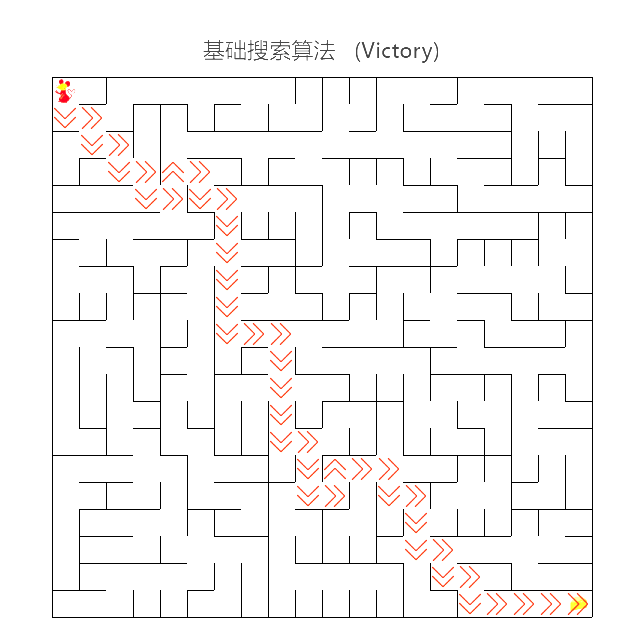
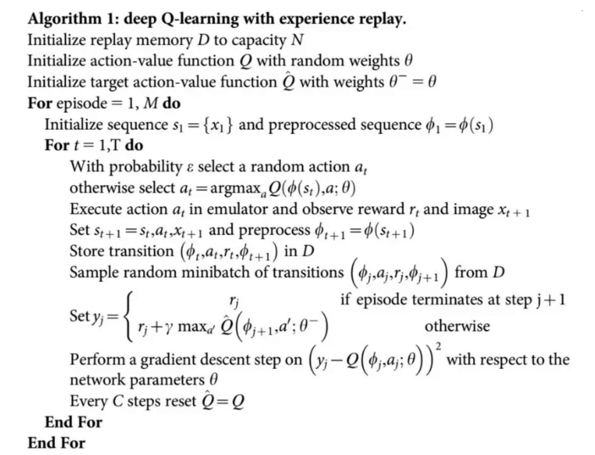
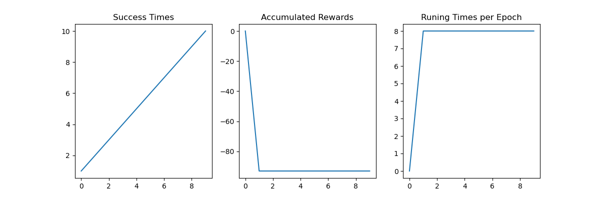
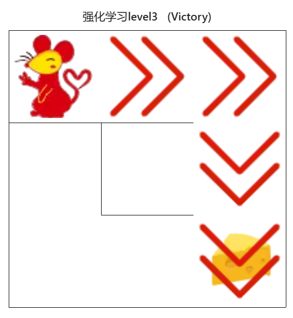
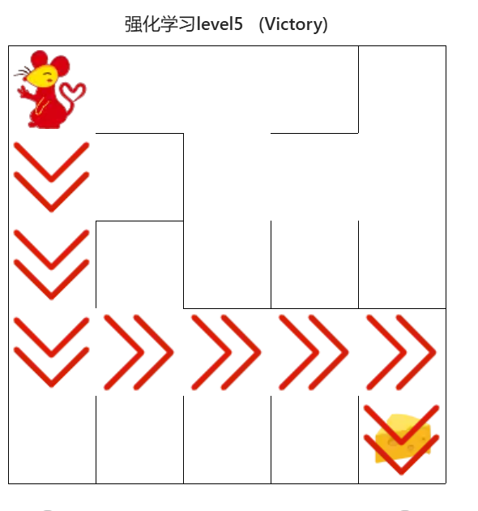
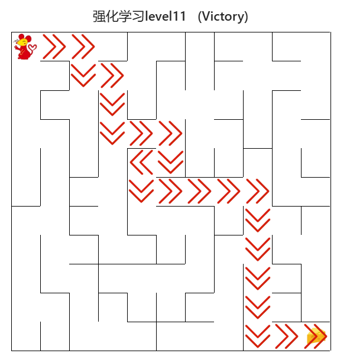
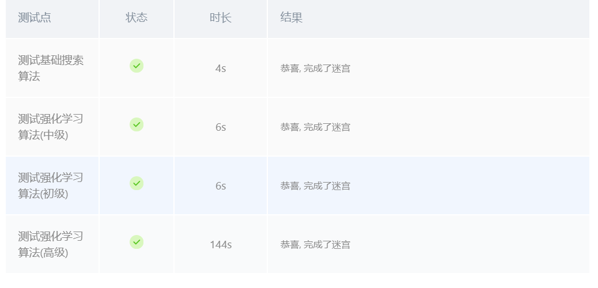

# 程序报告：机器人自动走迷宫
学号：22451122  
姓名：王中昊  
专业：软件工程

## 1. 任务1：使用经典算法求解迷宫问题

### 1.1 算法介绍

A*算法是一种广泛应用于图搜索和路径规划的启发式算法，它结合了最优性和启发性，从而有效地找到最短路径。A算法的核心思想是通过估计从起点到终点的代价来指导搜索过程。

算法的基本步骤如下：

1. **初始化**：
    - 将起点节点放入开放列表（open list），该列表用于存储待评估的节点。
    - 创建一个空的封闭列表（closed list），用于存储已评估的节点。

2. **选择节点**：
    - 从开放列表中选择总估计代价最低的节点作为当前节点，并将其移出开放列表，放入封闭列表。

3. **检查目标**：
    - 如果当前节点是终点节点，则路径搜索完成，返回路径。

4. **扩展邻居节点**：
    - 对当前节点的所有邻居节点进行评估：
      - 如果邻居节点已经在封闭列表中，跳过。
      - 如果邻居节点不在开放列表中，计算其估计代价，并将其加入开放列表。
      - 如果邻居节点已经在开放列表中，检查通过当前节点到达邻居节点的路径是否更短，如果是，更新其代价和父节点。

5. **重复**：
    - 重复步骤2到4，直到找到终点节点或开放列表为空（没有路径可达）。

A*算法的关键是代价估计函数，通常定义为：\[ f(n) = g(n) + h(n) \] 其中，\( g(n) \) 是从起点到当前节点 \( n \) 的实际代价，\( h(n) \) 是从当前节点 \( n \) 到终点的启发式估计代价。选择合适的 \( h(n) \) 函数对算法的效率和效果至关重要。

在这个实现中，启发函数被定义为当前位置与起点和终点的曼哈顿距离之和：


### 1.2 算法实现

```python
import heapq
import numpy as np

move_map = {
    'u': (-1, 0),  # up
    'r': (0, +1),  # right
    'd': (+1, 0),  # down
    'l': (0, -1),  # left
}

class SearchTree(object):
    def __init__(self, loc=(), action='', parent=None):
        """
        Initialize a search tree node object
        :param loc: The location of the robot at the new node
        :param action: The move direction corresponding to the new node
        :param parent: The parent node of the new node
        """
        self.loc = loc  # Current node location
        self.to_this_action = action  # Action to reach the current node
        self.parent = parent  # Parent node of the current node
        self.children = []  # Children nodes of the current node
        self.priority = 0  # Priority of the node

    def add_child(self, child):
        """
        Add a child node
        :param child: The child node to be added
        """
        self.children.append(child)

    def is_leaf(self):
        """
        Check if the current node is a leaf node
        """
        return len(self.children) == 0

    def __lt__(self, other):
        """
        Compare nodes based on priority
        """
        return self.priority < other.priority

def back_propagation(node):
    """
    Backtrack and record the node path
    :param node: The node to backtrack from
    :return: The backtracked path
    """
    path = []
    while node.parent is not None:
        path.insert(0, node.to_this_action)
        node = node.parent
    return path

def expand(maze, is_visit_m, node):
    """
    Expand leaf nodes, i.e., add child nodes reached by performing legal actions from the current leaf node
    :param maze: The maze object
    :param is_visit_m: Matrix recording whether each position in the maze has been visited
    :param node: The leaf node to be expanded
    """
    can_move = maze.can_move_actions(node.loc)
    for a in can_move:
        new_loc = tuple(node.loc[i] + move_map[a][i] for i in range(2))
        if not is_visit_m[new_loc]:
            child = SearchTree(loc=new_loc, action=a, parent=node)
            node.add_child(child)

def heuristic(loc, goal):
    """
    Calculate the heuristic function value, here using Manhattan distance
    :param loc: Current node location
    :param goal: Goal location
    :return: Heuristic function value
    """
    return abs(loc[0] - goal[0]) + abs(loc[1] - goal[1])

def a_star_search(maze):
    """
    Perform A* search on the maze
    :param maze: The maze object to be searched
    :return: The path found by A* search
    """
    start = maze.sense_robot()  # Get the start location
    goal = maze.destination  # Get the goal location
    root = SearchTree(loc=start)  # Create the root node
    open_list = []  # Priority queue for open nodes
    root.priority = 0 + heuristic(start, goal)  # Set the priority for the root
    heapq.heappush(open_list, (root.priority, 0, root))  # Push the root node into the priority queue
    h, w, _ = maze.maze_data.shape
    is_visit_m = np.zeros((h, w), dtype=np.int32)  # Matrix to record visited positions
    g_costs = {start: 0}  # Dictionary to record the actual cost from the start to each point
    path = []  # List to record the path

    while open_list:
        _, current_cost, current_node = heapq.heappop(open_list)  # Pop the node with the lowest priority
        is_visit_m[current_node.loc] = 1  # Mark the current node location as visited

        if current_node.loc == goal:  # If the goal is reached
            path = back_propagation(current_node)  # Backtrack to get the path
            break

        if current_node.is_leaf():
            expand(maze, is_visit_m, current_node)  # Expand the current node if it is a leaf

        for child in current_node.children:
            new_cost = current_cost + 1  # Assume the cost of each step is 1
            if new_cost < g_costs.get(child.loc, float('inf')):
                g_costs[child.loc] = new_cost  # Update the cost to reach the child node
                child.priority = new_cost + heuristic(child.loc, goal)  # Set the priority for the child
                heapq.heappush(open_list, (child.priority, new_cost, child))  # Push the child node into the priority queue

    return path

def my_search(maze):
    """
    任选深度优先搜索算法、最佳优先搜索（A*)算法实现其中一种
    :param maze: 迷宫对象
    :return :到达目标点的路径 如：["u","u","r",...]
    """
    # -----------------请实现你的算法代码--------------------------------------

    path = a_star_search(maze)
    # -----------------------------------------------------------------------
    return path
```

### 1.3 实验结果

以下为平台上的随机迷宫测试结果，A*算法能够以较小的步数快速抵达终点。


## 2. 任务2：实现 Deep QLearning 算法

### 2.1 算法介绍

强化学习是一个反复迭代的过程，每一次迭代要解决两个问题：给定一个策略求值函数，和根据值函数来更新策略。而 DQN 算法使用神经网络来近似值函数。以下是DQN算法的流程。




### 2.2 算法实现

算法基于Pytorch实现的MinDQNRobot基类，该基类是基于Deep Q-learning的迷宫机器人实现。为了获得稳定的表现，新实现的Robot类在初始化时即开始训练过程，直到Robot能够到达迷宫的终点才结束训练过程。完成训练的判断方式为进行一次完整的机器人寻路测试，观察是否存在与destination的reward值相同的位置，有则任务训练成功，结束循环。destination的reward被修改为`-self.maze.maze_size ** 2 * 10.` train_update中不再单独写入学习过程。Q-learning模型参数没有改动。


```python
import numpy as np
import torch
from torch_py.MinDQNRobot import MinDQNRobot
import time

class Robot(MinDQNRobot):
    def __init__(self, maze):
        """
        Initialize the Robot class.
        :param maze: Maze object
        """
        super(Robot, self).__init__(maze)
        self.maze = maze
        self.epsilon = 0  # Exploration rate
        self.maze.set_reward(reward={
            "hit_wall": 10.,  # Penalty for hitting a wall
            "destination": -self.maze.maze_size ** 2 * 4.,  # Reward for reaching the destination
            "default": 1.,  # Default reward for other actions
        })
        self.memory.build_full_view(maze=maze)  # Build the full view of the maze
        self.train()  # Train the robot and store the loss values

    def train(self):
        """
        Train the robot until it can solve the maze.
        :return: List of loss values during training
        """
        loss_list = []
        batch_size = len(self.memory)  # Size of the memory batch
        start = time.time()  # Start time for training

        while True:
            loss = self._learn(batch=batch_size)  # Learn from the batch
            loss_list.append(loss)  # Append the loss to the list
            self.reset()  # Reset the robot's state
            if self._is_training_complete():  # Check if training is complete
                print('Training time: {:.2f} s'.format(time.time() - start))  # Print the training time
                return loss_list  # Return the list of loss values

    def _is_training_complete(self):
        """
        Check if the training is complete by testing the robot.
        :return: Boolean indicating if training is complete
        """
        for _ in range(self.maze.maze_size ** 2 - 1):
            _, reward = self.test_update()  # Test the robot's update
            if reward == self.maze.reward["destination"]:  # Check if the robot reached the destination
                return True
        return False

    def train_update(self):
        """
        Update the robot's state and action during training.
        :return: Action taken and reward received
        """
        state = self.sense_state()  # Sense the current state
        action = self._choose_action(state)  # Choose an action based on the state
        reward = self.maze.move_robot(action)  # Move the robot and get the reward
        return action, reward

    def test_update(self):
        """
        Update the robot's state and action during testing.
        :return: Action taken and reward received
        """
        state = np.array(self.sense_state(), dtype=np.int16)  # Sense the current state
        state = torch.from_numpy(state).float().to(self.device)  # Convert state to tensor
        self.eval_model.eval()  # Set the model to evaluation mode
        with torch.no_grad():
            q_value = self.eval_model(state).cpu().data.numpy()  # Get Q-values from the model
        action = self.valid_action[np.argmin(q_value).item()]  # Choose the action with the minimum Q-value
        reward = self.maze.move_robot(action)  # Move the robot and get the reward
        return action, reward
```

### 2.3 实验结果

在`maze_size=5`时的训练过程的数据如下，由于在模型初始化时已经完成了训练，因此在后续的测试中结果不会随着epoch变化。


以下是在测试平台上的实验结果：
**初级迷宫**

**中级迷宫**

**高级迷宫**



## 3.最终测试结果

